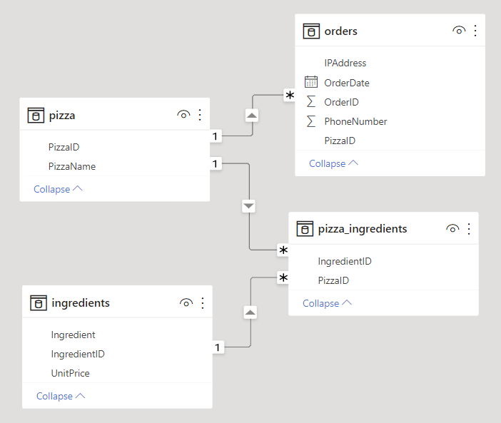
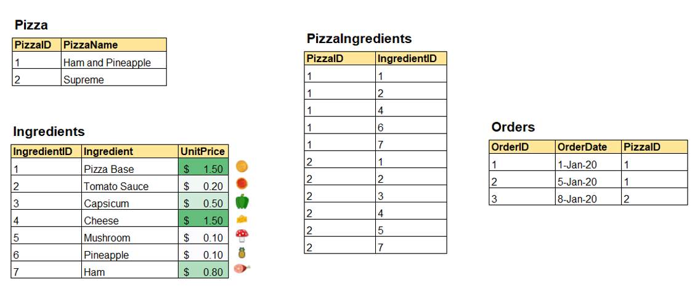
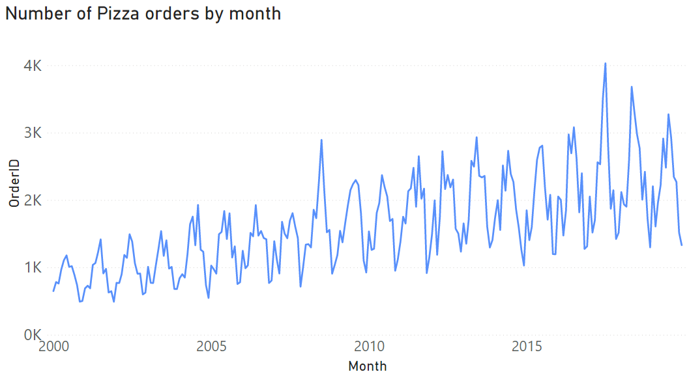

# pizza-data

Some sample time series data for demonstrations.

The keys can be linked in the following way:  

The records look something like this. There are some other randomly generated values as well.  

Aggregation of data by month in the orders table will produce a time series like this. This can be used to demonstrate forecasting methods on data that is not confidential or sensitive in any way.

